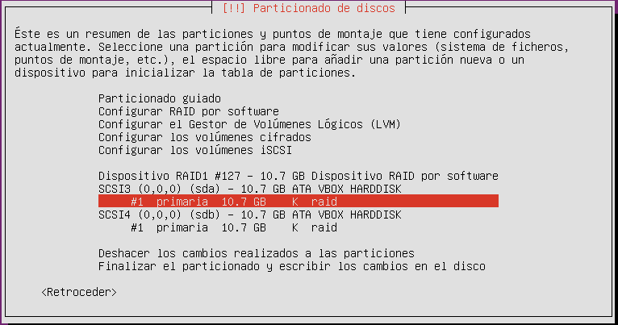
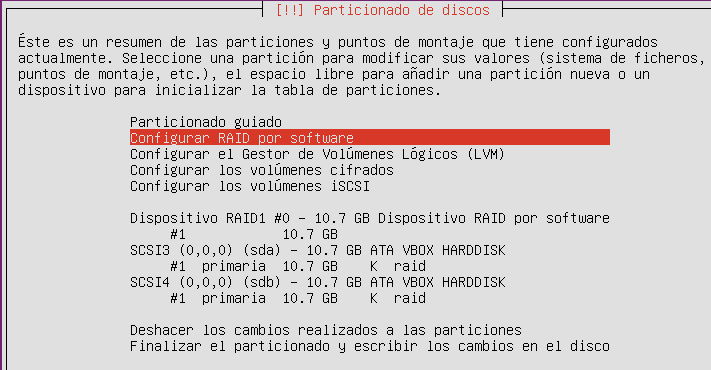

# Practica 1. INGENIERÍA DE SERVIDORES. UGR
## Virtualización e instalación de Sistemas Operativos

OBJETIVOS MÍNIMOS

1. Familiarizarse con distintos Sistemas Operativos (SOs) usados en servidores.

2. Conocer alternativas comerciales para tener un servidor

3. Configurar unidades de disco RAID y LVM.

4. Configurar una red local de máquinas virtuales.

5. Aprender a apagar una máquina (y hacerlo en VirtualBOX)

Lecciones

1. Instalación y configuración de Ubuntu Server

2. Configuración de LVM con CentOS

3. Configuración de RAID1 con CentOS

## Conceptos iniciales:
### 21/09/2018

Tenemos Servidores:

**DHCP**, Dynamic Host Configuration Protocol (Protocolo de Configuración Dinámica de Servidor)
   
(permite que una o más máquinas obtengan su configuración de red de manera totalmente automática, sin que tengamos que molestarnos nosotros en configurar IP, máscara de subred y puerta de enlace en cada una de las máquinas de nuestra red local).
**DNS**, Domain Name Space (Sistema de Nombres de Dominio) 
    
resuelve las peticiones de asignación de nombres.

Denominaremos tiempo de respuesta a R (También llamado latencia).
    
Productividad X (en algunos casos es el ancho de banda).

Vamos a trabajar con **Ubuntu Server**, un  S.O. basado en la arquitectura Debian cuyo patrocinador es Canonical,
   
también lo haremos con **CentOS** (Community ENTerprise Operating System) bifurcación de Linux Red Hat Enterprise  **RHEL**

**VPS** VIRTUAL PRIVATE SERVER.

En el desarrollo de las prácticas NO utilizaremos **Windows Server**  ni su versión nano por los requisitos técnicos a nivel de hardware, 
    
espacio y tiempo requerido.

**LOPD** Ley Orgánica de Protección de Datos de Carácter Personal.
   
**GPDR** Reglamento General de Protección de Datos (RGPD), reglamento relativo a la protección de las personas físicas en lo que respecta al 
    
tratamiento de datos personales y a la libre circulación de estos datos entró en vigor el 25/5/16 y se aplicó el 25/5/18.

**SERVERLESS**: es un modelo de ejecución de computación en la nube en el cual el proveedor de la nube actúa como servidor, administrando dinámicamente la asignación de los recursos de la máquina.

Código :arrow_right: (llama con IAC, Infraestructure As Code) :arrow_right: Infraestructura :arrow_right: Output
 
Los S.0. antes mencionados, los montaremos sobre VirtualBox, como máquinas virtuales (software que simula un sistema de computación y puede ejecutar programas como si fuese una computadora real.) 
Dentri de un SO anfitrión tenemos un SWVM el cual dentro tiene varios **VPS** (o servidores virtuales, particiones dentro de un servidores que habilita varias maquinas virtuales) a día de hoy se utilizan empresas que nos den housing.
La tecnología actual es la de contenedores, una alternativa a la virtualización  de máquinas virtuales.

Una MV maquina virtual aisla un SO de otro y un contenedor comparte recursos, tiene una menos sobrecarga y es mas homogeneo y mas fácil de administrar que la MV.

**VPS**: Contenido dedicado al servidor.
    
**¿QUÉ ES MEJOR RESERVADOR DINÁMICAMENE O ESTÁTICAMENTE?**
Depende, El Dinámico ahorras espacio en el disco y es mas portable entre dispositivos USB, el Estático nos mejora las E/S porque ya está hecha la reserva y se guarda en memoria seguidamente de forma continua.

**RAID**: Redundant Array od Independent Disks (anteriormente era inexpensive), sistema de almacenamiento de datos que utiliza múltiples unidades (discos duros o SSD), entre las cuales se distribuyen o replican los datos.
RAID 0: Conjunto dividido
conjunto1 conjunto2
(A1)      (A2)
(A3)      (A4)
RAID 1: Conjunto en espejo
conjunto1 conjunto2
(A1)      (A1) 
(A2)      (A2)
(A3)      (A3)
(A4)      (A4)       
RAID 10: Conjunto dividido con paridad distribuida

Disco1 Disco2 Disco3 Disco4

A       A       B       B

C       C       D       D

E       E       F       F

CUELLO DE BOTELLA en almacenamiento en la E/S externo
NO Mejora las prestaciones

**RAID HARDWARE**: mas rápido que uno software pero es mas caro 
**RAID SOFTWARE**: mas lento y mas barato que uno hardware necesita humanware

UPTAME EL MAYOR POSIBLE  (disponibilidad el máximo tiempo posible sin caidas).

## Pasos para la práctica 1:
21/09/18
1. Creamos una nueva máquina virtual cuyo nombre le daremos **UbServ-ISE2018** de tipo Linux con versión Ubuntu 64 bits
2. El tamaño de memoria será de 4 MB, creamos como disco virtual y como VDI (VirtualBox Disc Image) y que el alamacenamiento sea reservado de forma dinámica, la ubicación deñ archivo y tamaño seráe 4 MB, una vez hecho esto la creamos.
3. Configuramos dicha máquina, su almacenamiento, seleccionamos como archivo de disco óptico virtual Ubuntu Server 16.04.5 y agregamos un nuevo disco duro en Controlador:SAT que sea VDI Y nuevo disco y dinámico de 4 MB, deberían aparecernos 2 el de UbServ-ISE2018.vdi y el de NewVirtualDisk1.vdi
4. Iniciamos la nuevamáquina, seleccionamos Español como idioma y procedemos a instalar Ubuntu Server:
   * Seleccionamos nuestro país de origen.
   * NO detectaremos la disposición de teclado de forma automática, seleccionaremos nuestro teclado manualmente.
5. Indicamos el nombre de la máquina y nombre de usuario y NO cifraremos nuestra carpeta personal, configuramos zona horaria.
6. Procedemos a PARTICIONAR el disco de forma MANUAL:
    * Seleccionamos sda y posteriormente sdb y creamos una tabla de particiones cada una.
     

    * Configuramos RAID por software y creamos un dispositivo MD el cual serña un RAID1.
        Ese array RAID1 estará formado tanto por particiones libres(se usan solo si falla uno de los dispositivos activos) como activas (utilizadas), seleccionamos 2 dispositivos activos y 0 libres
    * Seleccionamos las 2 particiones sda1 y sdb1 como dispositivos activos para el RAID1 y terminamos la configuración.
    Nos debería quedar así:
     

7. Configuramos el gestor de volúmenes Lógicos(LVM) *LOGICAL VOLUME MANAGER*(está un nivel por encima de sda y sdb, agrupandolos)
   * Todos los Volúmenes y Grupos de Volúmenes han de estar a 0, creamos un grupo de volumenes e indicamos el nombre que queramos (hd por ejemplo).
   * Seleccionamos el dispositivo para el grupo e volúmenes (el que acabamos de crear). 
    Los volúmenes físicos en uso  y los grupos de volumenes han de estar a 1.
    Creamos diversos volumenes lógicos en el grupo volumenes que hemos creado antes. (lo hacemos para ganar flexibilidad)
    *NOTA: LVM IMPONE LA ABSTRACCIÓN SOBRE LV(LOGICAL VOLUMES) Y VG (VOLUME GROUP)
    1) /boot                            :arrow_right: 
    2) /home                            :arrow_right: 
    3) /                                :arrow_right:
    4) /swap (llamado logical volume)   :arrow_right: 
  
8. Creamos volumenes cifrados 

