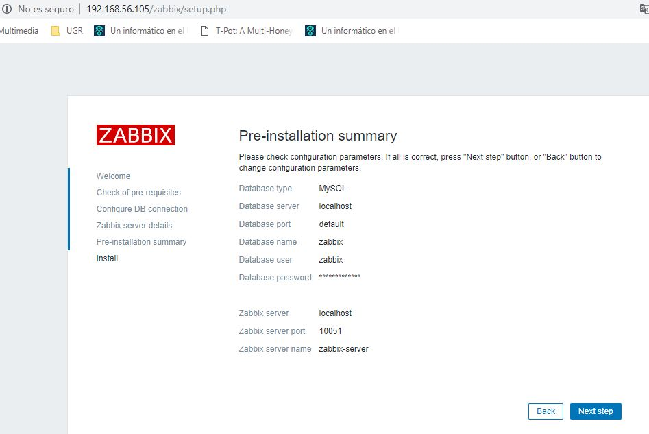
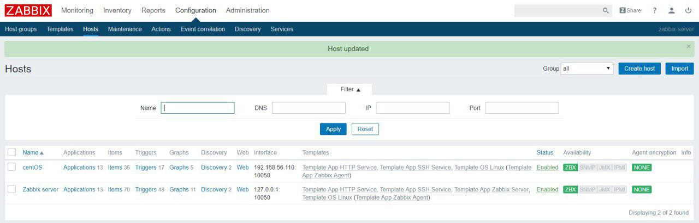
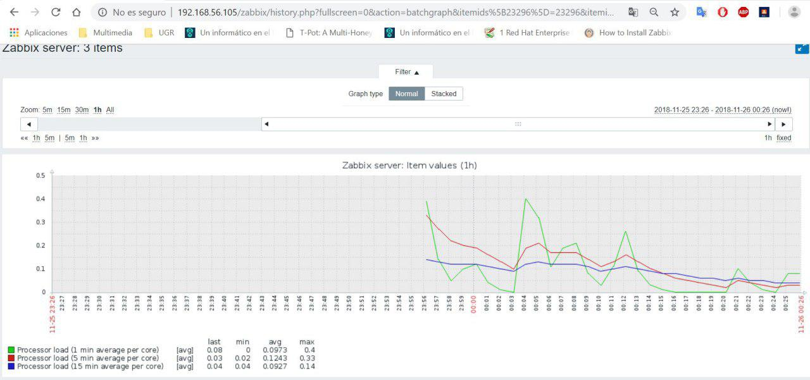

# Practica 4. Ingeniería de Servidores. UGR
##Instalación de Zabbix en Ubuntu Server y centOS 


* Zabbix es un Sistema de Monitorización de Redes. Está diseñado para monitorizar y registrar el estado de varios servicios de red, Servidores, y hardware de red.
* Tendremos de Servidor de Zabbix en Ubuntu Server y el agente de zabbix tanto en UbuServer como en centOS. 


##NOTA:
**La IP de la máquina de Ubuntu Server es: 192.168.56.105**

**La IP de LA máquina de centOS es:		   192.168.56.110**

**Previamente hemos configurado SSH para que se realice mediante el puerto 22022 en ambas máquinas**

**Durante toda la práctica estaremos con permisos de superusuario**

*Para ello ejecutamos en ambas máquinas:*

```
sudo su
```

## Pasos:

## Instalación del Servidor en Ubuntu Server

### 1. Instalación y Configuración de Zabbix Server en Ubuntu Server

Obtenemos el paquete de instalación

```
wget https://repo.zabbix.com/zabbix/3.4/ubuntu/pool/main/z/zabbix-release/zabbixrelease_3.4-1+xenial_all.deb
```

```
dpkg -i zabbix-release_3.4-1+xenial_all.deb
```

```
apt update
```

Instalamos la Base de Datos MySQL junto con el Frontend

```
apt install zabbix-server-mysql
```

```
apt install zabbix-frontend-php 
```

Ahora vamos a darle privilegios a la base de datos 

```
mysql -u root -p
```
*Introducimos la contraseña, practicas,ISE e introduciomos en SQL lo siguiente:*

```
mysql>create database zabbix character set utf8 collate utf8_bin;
mysql>grant all privileges on zabbix.* to zabbix@localhost identified by 'practicas,ISE'
mysql>quit;
```


Vamos a Importar el esquema de Base de Datos para Zabbix con:

```
zcat /usr/share/doc/zabbix-server-mysql/create.sql.gz | mysql -u zabbix -p zabbix
```

Editamos el Archivo de configuración de zabbix cuya ruta es: /etc/zabbix/zabbix_server.conf

```
vi /etc/zabbix/zabbix_server.conf
```

Alteramos los siguientes campos:

```
DBHost=localhost
DBName=zabbix
DBUser=zabbix
DBPassword=practicas,ISE
```

Editamos el archico de configuración de Apache2 y establecemos la zona horaria de Nuestro País

```
vi /etc/apache2/conf-enabled/zabbix.conf
```
*Alteramosel campo:* `php_value: date.timezone Europe/Madrid`


Reiniciamos el Servicio Apache2 y habilitamos el Servidor de Zabbix

```
systemctl restart apache2
systemctl start zabbix-server
systemctl enable zabbix-server
```
Comprobamos el estado del Servidor de Zabbix con: `systemctl status zabbix-server`


### 2. Configuración de la Interfaz Web de Zabbix

*Introducimos en nuestro navegador de confianza:* `

```
192.168.56.106.zabbix
```
Pasamos de la ventana de Bienvenida, (Welcome) a la pantalla Check of pre-requisites, vamos pasando con la pestaña Next step.


EN la ventana Check of pre-requisites ha de estar todo a OK, y clickamos en Next step nuevamente y pasamos a Configure DB connection y dejamos los campos así:

```
Database type: MySQL
Database host: localhost
Database port: 0
Database name: zabbix
User:		   zabbix
Password:	   practicas,ISE
```


Pasamos a la ventana de Zabbix server details y dejamos los campos:

```
Host: localhost
Pot:  10051
Name: zabbix-server
```


Aceptamos la Pre-instalación y la instalación y ya hemos finalizado la instalación!! Ahora para iniciar sesión, nuestro Username es: `Admin` y nuestro Password es: `zabbix`




Ahora ya podemos acceder al dashboard de monitorización, ahora vamos a configurar el agente.

### 3. Configuración del Agente Zabbix en Ubuntu Server
Vamos a instalar el paquete correspondiente y lo iniciamos:

```
apt install zabix- agent

systemctl start zabbix-agent

systemctl status zabbix-agent
```


### 3. Configuración del Agente Zabbix en centOS
Vamos a instalar el paquete correspondiente y lo iniciamos:

```
rpm -ivh https://repo.zabbix.com/zabbix/3.4/rhel/7/x86_64/zabbix-release-3.4-2.el7.noarch.rpm


yum install zabbix-agent
```

*Iniciamos el servicio del agente zabbix:*

```
systemctl start zabbix-agent
```
*¡Nos da un error!* Vamos a comprobar el fallo en el Log de Zabbix:


```
cat /var/log/zabbix/zabbix-agentd.log
```


Al final podemos ver que el problema es que no le hemos dado permisos, *cannot set resource limit:Permission denied*, vamos a darle permisos con `cat /var/log/audit/audit.log | grep zabbix_agentd | grep denied | audit2allow -M zabbix_agent`

Tras realiar este comando, nos devuelve el comando que debemos introducir para hacer ese paquete activo:

```
semodule -i zabbix_agent.pp
```


Iniciamos el servicio ahora que tenemos los permisos y comprobamos el estado:

```
systemctl start zabbix-agent

systemctl status zabbix-agent
```

Ahora que está funcionando, modificamos el archivo de configuración del agente zabbix de centOS(/etc/zabbix/zabbix_agentd.conf) para decirle que máquina es la servidora:

```
vi /etc/zabbix/zabbix_agentd.conf
```

Y modificamos en el archivo:

```
Server=192.168.56.105
ServerActive=192.168.56.105
Hostname=zabbix-server
```

Abrimos el puerto 10050 para que escuche centOS:

```
firewall-cmd --permanent --add-port=10050/tcp
firewall-cmd --reload
```

**Ya hemos configurado tanto el servidor en Ubuntu Server como el Agente en ambos Sistemas Operativos, ahora vamos a añadir Hosts para monitorizar con la Interfaz Web**

### 4. Añadiendo Hosts para Monitorizar en la Web
Añadimos el Host de Ubuntu Server:
En la ruta `Configuration -> Hosts`:

Host name: Zabbix serv
In Groups: Linux Servers y Zabbix Servers
Agent interfaces -> Ip address: 127.0.0.1
Agent interfaces -> Port 10050

Añadimos un nuevo Host
Host name: centOS
Groups in groups -> Linux servers
Agent interfaces -> IP address: 192.168.56.105


*¡Ya tenemos los 2 Host añadidos!* 

Añadimos los servicios a ambos Hosts los cuales queremos monitorizar:
Configuration->Hosts->Templates 
En la sección de Linux new templates añadimos Template App HHTP Service y Template App SSH Service
Pulsamos Add para confirmar que los añadimos.


Como el servicio ssh lo tenemos escuchando en el puerto 22022 tenemos que crear un item nuevo.
Nos vamos a la sección Items e introducimos en los siguientes campos:

```
Name: ssh 22022
Type: Zabbix agent
Key: net.tcp.service[ssh, ,22022]
Type of information: Numeric (unsigned)
Units: (se deja en blanco)
Update interval: 10s
Custom intervals -> Type: Flexible
Custom intervals -> Interval: 50s
CUstom intervals -> Period: 1-7,00:00-24:00
History storage period: 90d
Trend storage period: 365d
Show value: As is
New application: (en blanco)
Applications: SSH service 
```





:tada:  :tada:  :tada: :tada: :tada: 

¡¡Ya tenemos los 2 hosts monitorizando!!

:tada:  :tada:  :tada: :tada: :tada: 

**Ahora podemos monitorizar diversos servicios de nuestras maquinas como SSH O HTTP o incluso la carga**


Monitorización de la carga:




##Documentación
* [How to Install Zabbix Agent on CentOS/RHEL 7/6]: https://tecadmin.net/install-zabbix-agent-on-centos-rhel/
* [Zabbix Documentation 3.4 (centOS)]: https://www.zabbix.com/documentation/3.4/manual/installation/install_from_packages/rhel_centos
* [Zabbix Documentation 3.4 (UBUSERVER)]: https://www.zabbix.com/documentation/3.4/manual/installation/install_from_packages/debian_ubuntu
* [Install and use Zabbix 3.2 on CentOS 7 or RHEL 7]: http://jensd.be/393/linux/install-zabbix-on-centos-7-or-rhel-7
* [Zabbix Documentation 3.4 (5 Simple checks)]: https://www.zabbix.com/documentation/3.4/manual/config/items/itemtypes/simple_checks
* [How to Install and Configure Zabbix to Securely Monitor Remote Servers on Ubuntu 16.04]: https://www.digitalocean.com/community/tutorials/how-to-install-and-configure-zabbix-to-securely-monitor-remote-servers-on-ubuntu-16-04
* [Zabbix Documentation 3.2 (agent installation)]: https://www.zabbix.com/documentation/3.2/manual/installation/install_from_packages/agent_installation
* [Zabbix Documentation 3.2 (Server installation with MySQL database)]: https://www.zabbix.com/documentation/3.2/manual/installation/install_from_packages/server_installation_with_mysql
* [ZHow to Install and configure Zabbix agent 3.4 on CentOS 7]: https://computingforgeeks.com/how-to-install-and-configure-zabbix-agent-3-4-on-centos-7/


